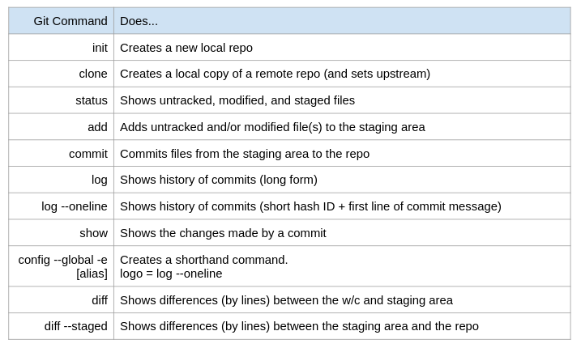
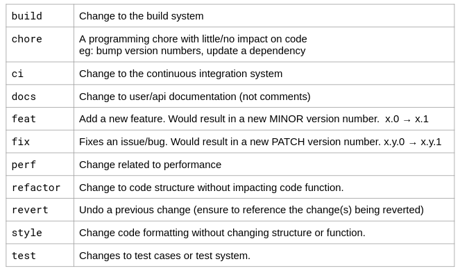
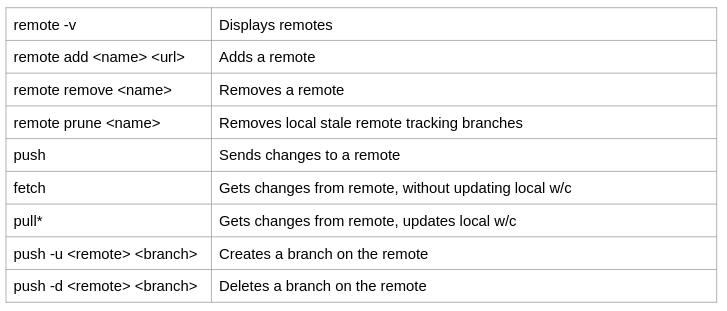

# Github Usage

## [Official Website](https://langarastudent.herokuapp.com/)

## Table of contents
* [Git Commands](#git-commands)
* [Commit Syntax](#commit-syntax)
* [Remote Commands](#remote-commands)
* [Set Up](#set-up)
* [Update](#update)
* [Merge](#merge)
* [Conflict](#conflict)
* [Important Commands](#important-commands)

## Git Commands


## Commit Syntax


## Remote Commands


## Set Up

I already "git init" the project, so you can skip "git init" and go ahead with: 

#### Option 1: As a developer ( Skip this step if you go with option 2 ) 

```
$ git clone https://github.com/Henry-Ta/Langara_Student
$ cd Langara_Student
```

#### Option 2: Open Source Software Workflow - OSS ( Skip this step if you with option 1 )

"fork" the [project](https://github.com/Henry-Ta/Langara_Student) to your own profile

and then "git clone" the "fork" version to your computer

```
$ git clone "folk version link"
$ cd Langara_Student
```

#### Update your github profile:

```
$ git config --global user.name "Yujeong"
$ git config --global user.email "yujeong.choung@gmail.com"
```

## Update

If use already had directory of project

```
$ git pull origin (Gets changes from remote, updates local w/c)
or
$ git fetch origin (Gets changes from remote, without updating local w/c )
```
Otherwise, clone the project

```
$ git clone https://github.com/Henry-Ta/Langara_Student
$ cd Langara_Student
```

## Merge
#### If you follow Option 1 in Set Up

If you're currently not in branch "master"

```
$ git checkout master
$ git merge --no-ff "name of current branch"   (note: --no-ff is merging not fast forward, you can use merge only in some cases not important )
$ git push origin
```

#### If you follow Option 2 in Set Up
Simply send me request to merge on github, then i'll process it

## Conflict 

Please check out conflicts and update every single of them by choosing "Use me" or "Use both" or simply leave it there and contact me to solve it

## Important Commands

```
$ git status ( always use to check whenever we see "red tick check" to know which file we need to update )
$ git log --oneline --all --graph ( to have a general view of each commit we send, press q to exit)

$ git add .
$ git commit ( or git commit -m if you don't want to edit in nano )

$ git push origin ( to upload local work to gitHub )
$ git fetch/pull origin ( to update current local work to get the latest project from gitHub )

$ git branch "name of branch" ( to create new branch )
$ git branch -d "name of branch" ( to delete a branch )
$ git checkout "name of branch" ( to move to a branch )
$ git merge "name of branch"
```

## Note

* Please apply "commit syntax" to have a general format throughout the project.
* Please feel free to update anything new for README.md
* Please create new branch for anything new or important, working on that branch and merge to clone before pushing local clone to gitHub

## Personal Message

 I'm not a master of gitHub and i'm on the way to learn more how to use Git so not everything can be solved from me as well as not everything is ideal to work in my way. Therefore, please feel free to give me your opinions and suggestions to improve our project.
